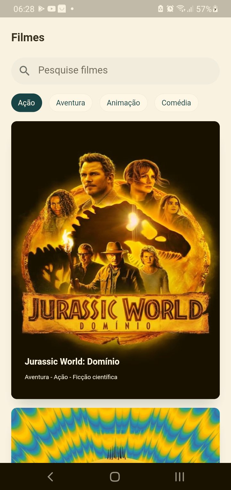
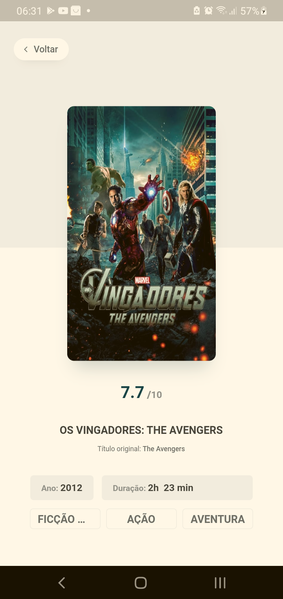

 
<h3 align="center"> Aplicativo para listagem e filtragem de filmes. </h3>
 

[//]: # (Adicione seus gifs / imagens aqui:)

 
   

   
  
  
  
  

## **Informações:**
[//]: # (Descreva seu objetivo e o que foi usado no projeto:)

* Projeto desenvolvido através do desafio técnico.

- **[THE MOVIE DB: Api](https://developers.themoviedb.org/3/getting-started/introduction)** 

<!-- ## **How to reach me:**
[//]: # (Adicione suas redes:)

[Instagram - Pessoal](https://www.instagram.com/dannbrandao_)

 -->

## **Linguagens e Ferramentas:**
[//]: # (Adicione os recursos do seu projeto aqui:)

- <code></code> **Flutter**
- <code></code> **Dart**

## Iniciar Projeto
[//]: # (Descreva aqui a forma de usar / instalar seu projeto:)

1° Clone este repo usando: git clone `https://github.com/brandaoti/search-movies.git`  
2° Mova-se para o diretório apropriado: `cd search-movies`  
3° Digite `flutter run` para instalar as dependência e apk  
4° Para o projeto funcionar é necessario criar um token e adicione no arquivo `core/client/service/ApiPathSettings` do projeto